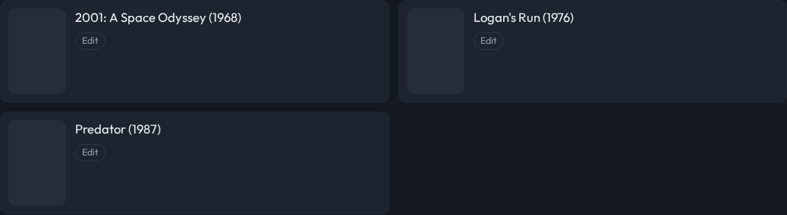
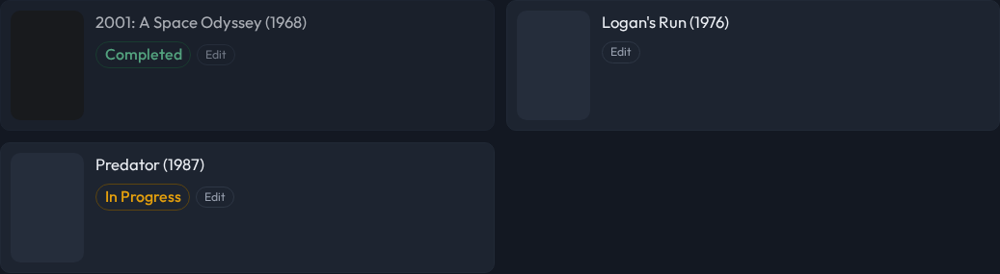

# "Completed" is judged when playback ENDS, not only when it starts

Status: Accepted
Date: 2026-08-16
Type: bugfix / architecture
Supersedes: —
Superseded by: —

## Decision

The finished-entry rule is evaluated **twice more**, and the badge stops being a report on
the last scan:

1. **The write side runs when playback ends.** `applyQueueWriteSide()` (revive stale-done →
   mark newly-finished → TTL sweep) moves out of `session.startSession` into
   `server/src/finished.ts`, and `reconcileQueue()` re-runs it — over the same
   `provider.buckets()` resolution, playing nothing — when an item leaves the screen.
   The trigger is the existing `queuepilot/now-playing` bridge: a real item followed by
   `idle`/`stopped`/a different ratingKey, debounced 5 s. **Which** set is read off the
   retained `queuepilot/state` topic, so a server restarted mid-movie still reconciles.
2. **`/api/queues` reports `isFinished` live.** The same rule the engine marks by, judged now:
   for a MOVIE, `watched.has(ratingKey) && !inProgress(...)` — `select.watchedForSet`'s
   history (memoized per accounts × sections, 60 s, dropped on the same playback event) plus
   **one batched `/library/metadata/<ids>` call** for the watched candidates.
3. **The grid means both.** `isCompleted(item) = item.done || item.isFinished` drives the
   Completed badge, the greyed tile and the "Completed / fully watched" filter.
   **"Remove all completed" still keys off `done` alone** — it deletes lines from
   `queues.yaml`, and the endpoint can only remove what the file has flagged.

`done` remains the record of truth for everything that WRITES (the TTL sweep, the remove
sweep). `isFinished` never writes; it only says what the next scan will decide.

## Context

Live, 2026-08-16. The owner finished *2001: A Space Odyssey* on **Bob & Alice — Movies**
at 22:34 and reported that it "didn't show Completed this time."

Plex was certain:

```
ratingKey 177756  viewCount 1  lastViewedAt 1786937665 (22:34:25)
/status/sessions/history/all?accountID=1&librarySectionID=1 → top row, 22:34:25
```

QueuePilot was not: `queues.yaml` still held the bare entry `{ratingKey: "177756", title:
"2001: A Space Odyssey (1968)"}` and `/api/queues` answered `done: false` for **all 21**
entries of that queue.

The cause is not the rule but its one trigger. `queues.markDone` had exactly one caller —
`session.startSession:282` — so the rule ran on a session START and nowhere else. There is no
periodic scan (by design: HA owns schedules, and no automation publishes one), and no hook on
the end of playback. The container log shows the last `session/start {"set":"bob_alice"}`
at 21:12, an hour and a half before the credits. The badge was therefore **always one card tap
behind**, for every queue, since the flag was introduced (2026-07-21) — the owner had simply
been looking after a later scan every previous time.

A second, quieter staleness sat underneath. A movie tile reads its `viewCount`/`viewOffset`
off `plex.resolveTitle`, which is the SQLite `resolved` cache: **7-day TTL, no validator**,
and the now-playing invalidation drops a *show's* leaves and knows nothing about movies. So a
title-string movie entry can render a week-old watch state, and "In Progress" with it.

## Why

- **`done` is a cache of a resolution result** (2026-08-15), so the honest thing when it
  disagrees with live Plex is to believe Plex. That decision made the flag self-healing on the
  way *in* (a done entry revives when something is playable); this one makes it self-healing on
  the way *out*.
- **The end of playback is the event that changes the answer.** Plex writes the history row as
  the credits run. Reconciling there is precise and free — no timer, no poll, no new schedule
  (which would belong to HA anyway) — and it costs one scan-shaped resolution per movie
  watched.
- **A badge that can only be as fresh as the last scan is not a badge about the library.** The
  live half is what covers the gap between the credits and the next scan, and the case the
  reconcile can never see: something watched on a phone, where QueuePilot is not involved at
  all.
- **One rule, one implementation.** The write side is lifted verbatim rather than reimplemented
  so a scan and a reconcile cannot drift, and the live predicate is the engine's own movie
  branch (`resolveMember`: `keepMovie = !watched.has(rk)`, un-dropped when in progress) rather
  than a second opinion. `viewCount` alone would have been the wrong source — per-profile
  watched state is history, and the cross-account union was tried and reverted (2026-07-16).
- **Movies only, deliberately.** A show or collection already reports "nothing left" through
  `nextEp: null` → "All watched". Re-deriving a series' remaining episodes here (specials,
  start floors, batch stops) would be exactly the second rule this decision exists to avoid.

## Evidence

- Owner, 2026-08-16: *"Just finished 2001 A Space Odyssey on 'Bob & Alice — Movies' via
  QueuePilot. It didn't show Completed this time"*.
- Live `/api/queues` for `bob_alice`: 21 items, `done: false` on every one, with `177756`
  first — while Plex reported `viewCount: 1` for it.
- `docker logs ix-queuepilot-queuepilot-1`: `session/start` for `bob_alice` at 20:18, 21:11
  and 21:12 local; nothing after. `midclt call cronjob.query`: no QueuePilot cron (SMART,
  icons, catalog.sync, note-capture, pin-check — none of them this app).

## Tests

`e2e/finished-live-test.ts` (offline, no token, no network), in CI:

- **reconcile** — over the synthetic engine corpus: a finished entry is marked `done` with no
  session at all, `SESSION_CTL.drives`/`plays` stay EMPTY (it must never play), a
  `keep_completed` set and a `reel` are still never marked, and an unknown set returns rather
  than throws.
- **live badge** — the real server against a stub Plex whose section listing (what the
  7-day cache holds) reports the PRE-playback view state while `/library/metadata/<ids>`
  reports the truth. A tile reading its watch state off the cache fails the suite. Asserts a
  finished film reads `isFinished: true` while the file still says nothing, an unwatched one
  does not, and a film **in history but sitting at a resume point** is In Progress with its
  live offset — the Prison School rule at the movie level.

`web/src/lib/tileFace.test.ts` covers `isCompleted` over both sources. The parity gates
(`mark-done-parity`, `curated-parity`, `engine-parity`, `keep-completed-test`) are what pin
that lifting the write side out of `session.ts` moved nothing.

## Shots

`e2e/shot-completed-badge.ts` runs the whole thing itself (stub Plex → real server →
browser), so the same command in a `main` checkout and in this branch differs only by the
code.

Before — `docs/images/2026-08-16-completed-badge-before.png`. Three bare tiles: the film
finished minutes ago says nothing, and neither does the one being watched again (that is the
stale `resolved` cache).



After — `docs/images/2026-08-16-completed-badge-after.png`.


