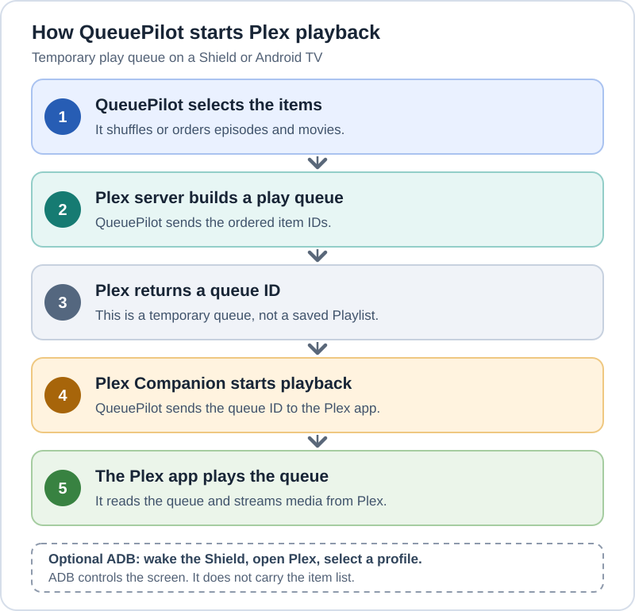

# How Plex playback reaches a Shield or Android TV

QueuePilot has two ways to start Plex playback. Its `PLAYBACK_MODE` setting is `client` or
`cast`; this is a QueuePilot setting, not a Plex setting. The diagram shows `client`: QueuePilot
chooses the items and their order, Plex Media Server holds them in a temporary **play queue**,
and QueuePilot asks the Plex app to start it. This does not create a saved Plex Playlist.

[Open the diagram by itself](images/plex-client-playback.svg).

The play request can come from the web app or an MQTT automation, including one started by
Home Assistant. Home Assistant does not deliver the queue to the player in this mode.

QueuePilot sends the ordered item IDs to Plex Media Server with `POST /playQueues`. It then
sends the returned queue ID and the first item's ID to the player's Plex Companion
`playMedia` endpoint. The Plex app reads the queue from the server and plays its items in
that order. QueuePilot can add more items to a live queue when a set uses refill.

ADB is a separate, optional control path for the Shield. It can wake the device, open
Plex, and select a Plex Home profile before playback. ADB does not send the item list.
The current profile-picker automation is built around the Shield's Plex Android TV UI;
check it on another Android TV device before relying on automatic profile switching.
In `client` mode, Plex records playback under the profile signed into the player.

`PLAYBACK_MODE=cast` is a different path. It uses the Cast sidecar and Google Cast instead
of a Plex Companion `playMedia` command. It is not Home Assistant's Cast integration.
